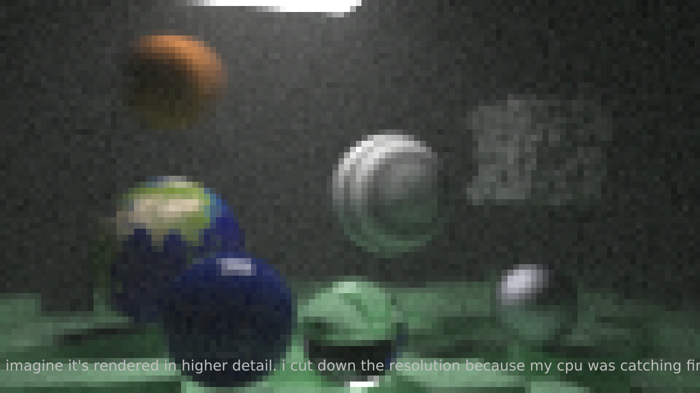

# raytracer

ray tracer i ~~stole~~ implemented following [this pdf](https://www.realtimerendering.com/raytracing/Ray%20Tracing%20in%20a%20Weekend.pdf)

see the image at the end of [the second book](https://www.realtimerendering.com/raytracing/Ray%20Tracing_%20The%20Next%20Week.pdf) for how it should have looked in higher resolution

### some extra features i added
- realtime output to window using SDL
- multithreaded rendering
- scene loading from files
- AVX256 intrinsics

### Q&A
Q: Is it realtime?
The time is real. if you run it on a decent processor it might finish rendering before the heat death of the universe
