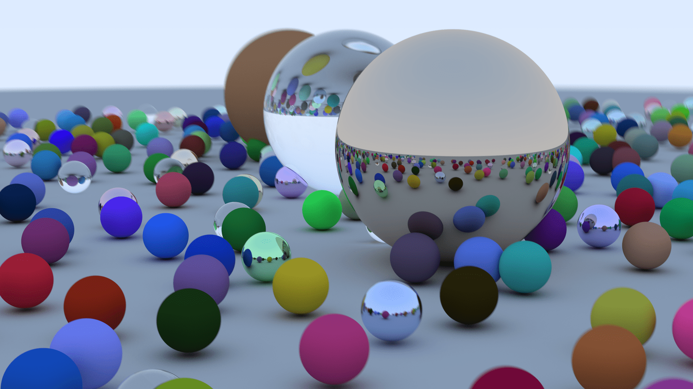
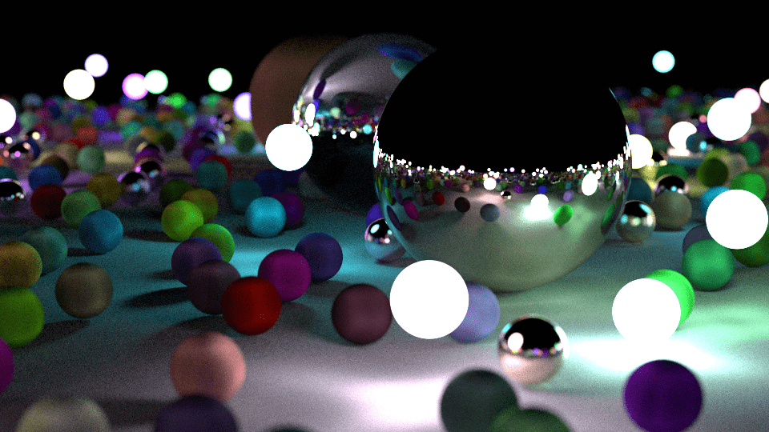

# raytracer

ray tracer implemented in pure C following [this book](https://www.realtimerendering.com/raytracing/Ray%20Tracing%20in%20a%20Weekend.pdf)

### diffuse, metal and dielectric materials

### light emmision

### motion blur, subsurface scattering, constant medium and textures

### some extra features i added
- realtime output to window using SDL
- multithreaded rendering
- scene loading from files
- AVX256 intrinsics